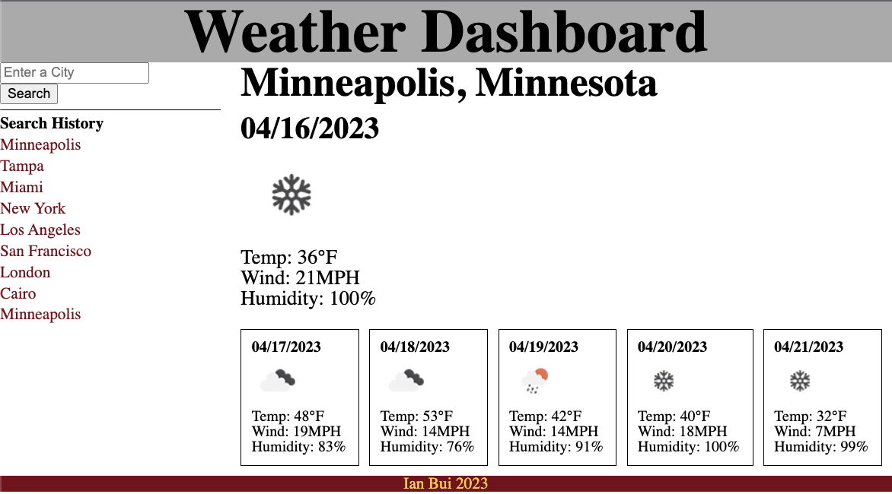

# umn-edx-weather-dashboard

## SUMMARY
This is a basic weather query page that fetches and displays weather for a particular city based upon user input.  Weather information includes the current day and a 4-5 day forecast.  It is powered by OpenWeather.

## NOTES
The city selection isn't the smartest as it simply selects the first matching city.  For instance a search for "Rochester" would display the weather for Rochester, NY and not Rochester, MN.  It is dependent on OpenWeather's API to sort the matching cities based on relevance.

Since one of the OpenWeather's API endpoints being used sends data in 3-hour blocks, the code simply picks the highest temperature, wind speed, and humidity values for each day.

The weather icon selection also is very crude by taking advantage of precipitation having higher code numbers than clear skies.  This can have the effect of exaggerating the amount of precipitation as well as omit certain types if a day is expected to have multiple types of precipitation.  Unless another API endpoint is used, complex logic should be implemented to pick icons that accurately summarize each day.

Because this API endpoint provides only so much forecast data, there may or may not be data for the 5th day in the forecast, so logic had to be used to hide that day if no data is provided for it.  This case may happen late at night in the US.

Also time based operations are performed in the browser's time zone, so some weather data may be shown on the wrong days for cities in other time zones.  Fetching of time zones and logic to add the proper offsets need to be added.

## LIVE VIEW
This portfolio can be viewed here: https://thinkbui.github.io/umn-edx-weather-dashboard/

